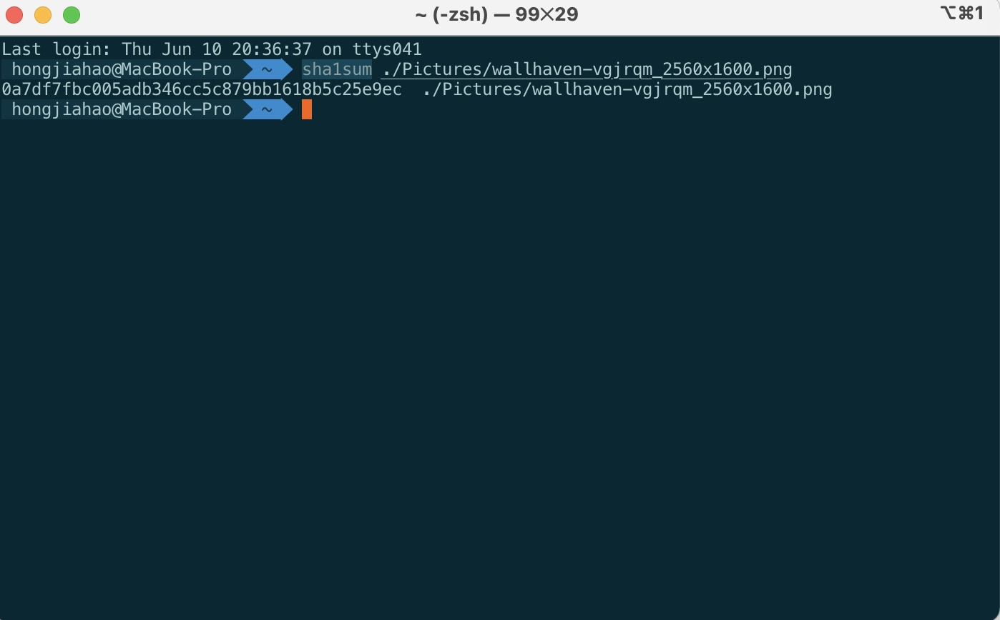
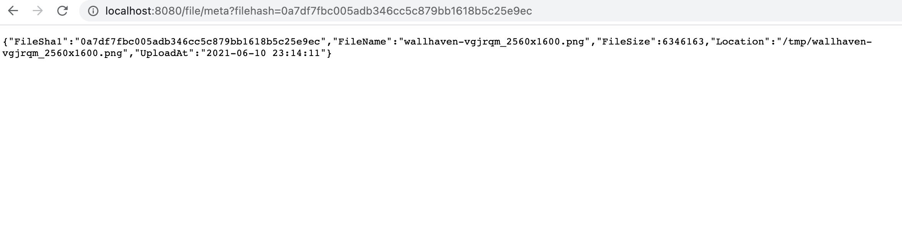
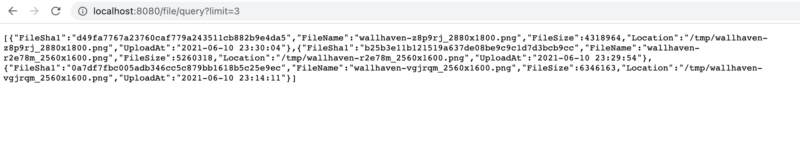
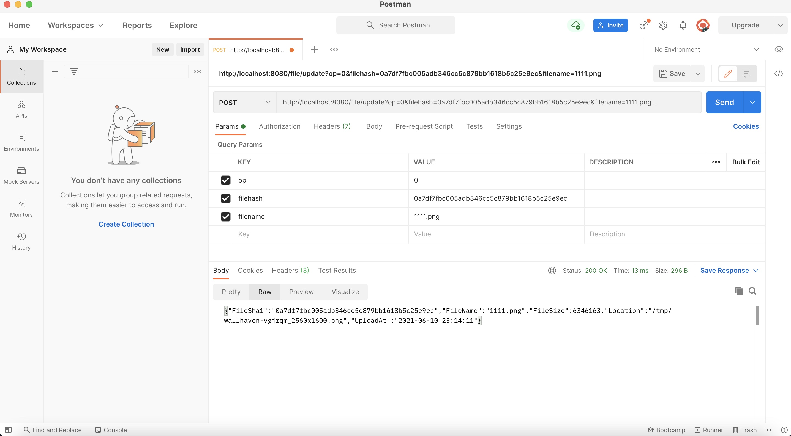

# distributed-fileServer

## 介绍

&emsp;&emsp;本项目实现了一个最基本的远程文件存储服务，功能包括上传文件至服务器、在内存中存储上传文件的元信息、获取文件元信息、更新文件元信息(重命名)以及删除远程服务端的文件及内存中的文件元信息。下面是对这些功能的掩饰。

## 文件服务

### 文件上传

&emsp;&emsp;将服务部署在8080端口，通过浏览器访问文件上传服务的路由"/file/upload",可以进入文件上传服务的页面，如下所示：

&emsp;&emsp;点击Browse选择要上传的文件后(目前每次上传仅支持单一小文件上传，要上传多个文件需要多次进行上传操作)，文件会被上传到服务端的"/tmp"目录下。之后会跳转到上传成功页面：

### 获取文件元信息

&emsp;&emsp;首先在本地打开终端，使用sha1sum工具获取上传文件的hash值

&emsp;&emsp;MacOS用户可以参考[Macos 安装md5sum、sha1sum、md5deep、sha1deep](https://blog.csdn.net/cup_chenyubo/article/details/52982986)进行安装，上图中以0a7开头的字符串就是该文件的hash值。之后通过浏览器输入下图所示的URL，?filehash =0a7df7fbc005adb346cc5c879bb1618b5c25e9ec是提供给网络服务器的额外参数(上传文件的hash值)，可以得到文件的元信息：

### 批量获取上传文件的元信息

&emsp;&emsp;如果上传了多个文件，想要一次性获得多个文件的元信息，可以通过下图的URL进行访问，limit表示返回元信息的数量，按照后上传优先的顺序排序：

&emsp;&emsp;这里返回了三个文件的元信息。要注意的是由于本项目目前是将文件元信息存储在内存中的，所以一旦重启服务，虽然上传到服务端的文件还在，但是文件元信息全会丢失。后续会进行优化，引入MySQL数据库进行保存。

### 文件下载

&emsp;&emsp;通过访问URL：http://localhost:8080/file/download?filehash=d49fa7767a23760caf779a243511cb882b9e4da5。filehash中输入要下载的文件的hash值可以从服务端下载文件。

### 更新文件元信息(重命名)

&emsp;&emsp;通过路由"/update"可以实现文件元信息中文件名的重命名。通过URL上传3个参数：op、filehash、filename用以指定文件改名，通过postman来进行验证：

图片名已经变成了1111.png。

### 服务端图片删除

&emsp;&emsp;先会删除服务端的文件的物理存储，然后再删除内存中保存的文件元信息。通过postman测试：

返回的Header中状态码显示为200，表明成功删除。

## 将文件元信息存储在mysql数据库中持久化
### 新的文件上传完成后保存元信息的接口
&emsp;&emsp;实现`OnFileUploadFinished`方法，在文件上传完成后，将文件的元信息保存在mysql数据库中。

### 新的获取文件元信息接口
&emsp;&emsp;实现`GetFileMeta`方法，从mysql数据库中查询对应hash值的文件的元信息。

### 批量获取文件元信息
&emsp;&emsp;实现`GetFileMetaList`方法，从mysql数据库中批量查询元信息。

### 从数据库中删除（更改状态为删除）
&emsp;&emsp;实现`OnFileRemoved`方法，将被删除的文件在mysql中的status置为2。